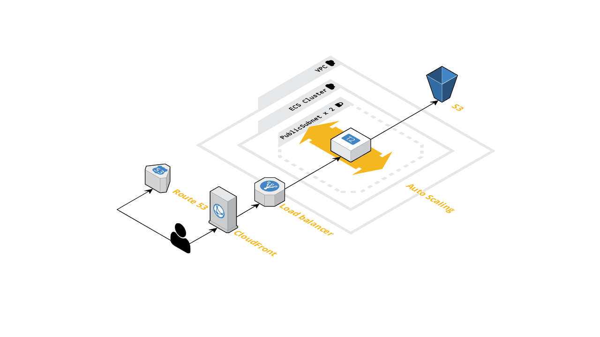
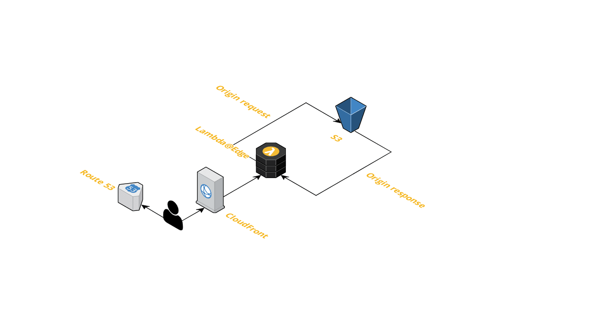
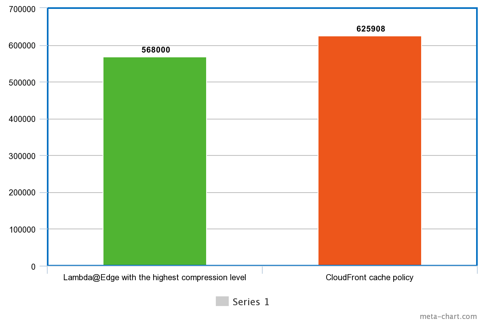

There are different strategies for serving static assets. The ultimate goal is to reduce to traffic amount going through the network as well as client latency.

### The most basic architecture

The CloudFront has in-built Gzip and Brotli compression. The problem is that CloudFront never uses the highest compression level, it chooses between 2 and 5 compression levels. The larger the file, the larger the compression level. The highest compression level is performance sensitive, but actually it's done only once since the content gets cached after the compression.

See the CloudFormation template below, note that I've got an existing S3 bucket, Route53 hosted zone and issued ACM certificate.

<details><summary>See the CloudFormation template</summary>
<p>

```yml
AWSTemplateFormatVersion: 2010-09-09

Parameters:
  BucketName:
    Type: String

  DomainName:
    Type: String

  CertificateArn:
    Type: String

  HostedZoneId:
    Type: AWS::Route53::HostedZone::Id

Resources:
  CloudFrontOriginAccessIdentity:
    Type: AWS::CloudFront::CloudFrontOriginAccessIdentity
    Properties:
      CloudFrontOriginAccessIdentityConfig:
        Comment: !Sub Identity for distribution of ${DomainName}

  BucketPolicy:
    Type: AWS::S3::BucketPolicy
    Properties:
      Bucket: !Ref BucketName
      PolicyDocument:
        Version: 2012-10-17
        Statement:
          - Effect: Allow
            Action: s3:GetObject
            Resource: !Sub arn:aws:s3:::${BucketName}/*
            Principal:
              AWS: !Sub arn:aws:iam::cloudfront:user/CloudFront Origin Access Identity ${CloudFrontOriginAccessIdentity}

  CloudFrontDistribution:
    Type: AWS::CloudFront::Distribution
    Properties:
      DistributionConfig:
        Enabled: true
        PriceClass: PriceClass_100
        DefaultRootObject: index.html
        Comment: !Sub CloudFront distribution for ${DomainName}
        Aliases:
          - !Ref DomainName
        ViewerCertificate:
          SslSupportMethod: sni-only
          AcmCertificateArn: !Ref CertificateArn
        Origins:
          - Id: s3-origin
            DomainName: !Sub ${BucketName}.s3.amazonaws.com
            S3OriginConfig:
              OriginAccessIdentity: !Sub origin-access-identity/cloudfront/${CloudFrontOriginAccessIdentity}
        DefaultCacheBehavior:
          Compress: true
          TargetOriginId: s3-origin
          ViewerProtocolPolicy: redirect-to-https
          ForwardedValues:
            QueryString: false
        CacheBehaviors:
          - Compress: true
            TargetOriginId: s3-origin
            ViewerProtocolPolicy: redirect-to-https
            PathPattern: /assets/*
            # This is a managed CloudFront policy which enables Brotli compression.
            CachePolicyId: 658327ea-f89d-4fab-a63d-7e88639e58f6
            ForwardedValues:
              QueryString: false

  RecordSet:
    Type: AWS::Route53::RecordSet
    Properties:
      Type: A
      Name: !Ref DomainName
      HostedZoneId: !Ref HostedZoneId
      AliasTarget:
        # Default CloudFront zone ID.
        HostedZoneId: Z2FDTNDATAQYW2
        DNSName: !GetAtt CloudFrontDistribution.DomainName
```
</p>
</details>


### The most complicated and unwanted architecture

Before the existence of the Lambda@Edge service and in-built Brotli compression it was possible to use the Nginx server as a proxy between the bucket and the CloudFront. The Nginx server was compiled with a Brotli module and did provide the highest compression level.

For the purpose of fault tolerance, the autoscaling group was used with the `DesiredCapacity: '1'`. The CloudFront cannot route traffic to EC2 instances, so it was meaningful to place the ALB behind the EC2 instance.

So the flow was looking as following:

1. The client resolves the IP address of the nearest CloudFront server (edge location)
2. The client sends `GET /main.js` HTTP request
3. CloudFront routes the traffic to ALB and the ALB routes the traffic to the EC2 instance (with Nginx installed)
4. The Nginx server routes the traffic to S3, receives the response, compresses files (Gzip or Brotli) using the highest compression level, caches and sends compressed files back with `Content-Encoding` and `Content-Length` headers
5. CloudFront caches the response and never sends traffic to Nginx again (until edge locations are invalidated)

To keep the bucket private it was possible to create a bucket policy with a custom user agent. The IAM service validated the user agent and passed forward the request to S3:

```yml
BucketPolicy:
  Type: AWS::S3::BucketPolicy
  Properties:
    Bucket: !Ref BucketName
    PolicyDocument:
      Version: 2012-10-17
      Statement:
        - Effect: Allow
          Action: s3:GetObject
          Principal: '*'
          Resource: !Sub arn:aws:s3:::${BucketName}/*
          Condition:
            StringLike:
              aws:UserAgent: this_should_be_very_secur3
```

The user agent was also duplicated inside the Nginx config:

```
server {
  location / {
    limit_except GET {
      deny all;
    }

    set $aws_bucket "my-bucket";

    proxy_set_header User-Agent this_should_be_very_secur3;
    proxy_buffering off;
    proxy_pass https://${aws_bucket}.s3.${aws_region}.amazonaws.com/$request_uri;
  }
}
```



Such architecture is hard to maintain and I don't think it's cost-effective.

### The most optimal architecture

The Lambda@Edge is a single lambda, the only difference is that only CloudFront can be its trigger. This lambda can be created only in us-east-1 region but then it gets replicated among CloudFront edge locations.

See the CloudFormation template below. Note that the `Custom::CrossRegionStack` is just a custom resource that allows to create a cross-region stack. I didn't provide its lambda source code, since it's not needed right now. This lambda just takes parameters, region and template body and creates a CloudFormation stack in another region (that is specified in `Region` property).

We can pre-compress all static files during the continious delivery and serve static files with the highest compression level and the lowest network throughput.

<details><summary>Collapse the CloudFormation template</summary>
<p>

```yml
AWSTemplateFormatVersion: 2010-09-09

Resources:
  EdgeLambdaRole:
    Type: AWS::IAM::Role
    Properties:
      Path: /
      ManagedPolicyArns:
        - arn:aws:iam::aws:policy/service-role/AWSLambdaBasicExecutionRole
      AssumeRolePolicyDocument:
        Version: 2012-10-17
        Statement:
          - Effect: Allow
            Action: sts:AssumeRole
            Principal:
              Service:
                - lambda.amazonaws.com
                - edgelambda.amazonaws.com

  EdgeLambdaCrossRegionStack:
    Type: Custom::CrossRegionStack
    Properties:
      ServiceToken: !Ref CrossRegionLambdaArn
      # Edge lambdas have to be created in the us-east-1 region
      Region: us-east-1
      StackName: edge-lambda-stack
      Parameters:
        EdgeLambdaRoleArn: !GetAtt EdgeLambdaRole.Arn
      TemplateBody: |
        AWSTemplateFormatVersion: 2010-09-09

        Parameters:
          EdgeLambdaRoleArn:
            Type: String

        Resources:
          EdgeLambda:
            Type: AWS::Lambda::Function
            DeletionPolicy: Retain
            Properties:
              Runtime: nodejs12.x
              Timeout: 5
              MemorySize: 128
              Role: !Ref EdgeLambdaRoleArn
              Handler: index.handler
              Code:
                ZipFile: |
                  async function handler(event, context) {
                    const { request } = event.Records[0].cf;
                    const { br, gz } = parseAcceptEncodingHeader(request);
                    if (br) {
                      request.uri += '.br';
                    } else if (gz) {
                      request.uri += '.gz';
                    }
                    return request;
                  }

                  module.exports = { handler };

          EdgeLambdaVersion:
            Type: AWS::Lambda::Version
            Properties:
              FunctionName: !Ref EdgeLambda

        Outputs:
          EdgeLambdaVersionArn:
            Value: !Ref EdgeLambdaVersion

  CloudFrontDistribution:
    Type: AWS::CloudFront::Distribution
    Properties:
      DistributionConfig:
        ...
        DefaultCacheBehavior:
          ...
          LambdaFunctionAssociations:
            - EventType: origin-request
              LambdaFunctionARN: !GetAtt EdgeLambdaCrossRegionStack.EdgeLambdaVersionArn
```
</p>
</details>



### Comparison

1. The `main.js` file is 2.8M uncompressed
2. CloudFront compressed it to 625908 bytes size
3. `brotli -k9` compressed it to 568000 bytes size

We do serve A LOT of static assets, the highest compression level saves traffic by 10-15% (depends on the file content, different compression levels can differ for different files).



### Continious delivery example

<details><summary>Collapse the CodeBuild template</summary>
<p>

```yml
version: 0.2

phases:
  install:
    runtime-versions:
      nodejs: 14
    finally:
      - echo Installation done
  build:
    commands:
      - echo Entering build phase...
      # It's better to have a custom Docker image that has `brotli` pre-installed
      # or use a Webpack plugin.
      - apt-get update && apt-get install -y brotli
      - npm ci
      - npm run build-staging

    finally:
      - echo Build completed on `date`

  post_build:
    commands:
      # Empty S3 bucket.
      - aws s3 rm s3://${S3_BUCKET} --recursive
      - echo S3 bucket is emptied.
      - aws s3 sync
      # Copy non-compressed files.
      - aws s3 sync ./dist/apps/client s3://${S3_BUCKET} --exclude ".gz" --exclude ".br"
      # Gzip with the highest compression level.
      - gzip ./dist/apps/client -rk9
      - aws s3 sync ./dist/apps/client s3://${S3_BUCKET} --include ".gz" --content-encoding gzip
      # Brotli with the highest compression level.
      - brotli ./dist/apps/client -rk9
      - aws s3 sync ./dist/apps/client s3://${S3_BUCKET} --include ".br" --content-encoding br
      # Invalidate the edge cache.
      - aws cloudfront create-invalidation --distribution-id ${DISTRIBUTION_ID} --paths /index.html --output json
      - echo Build completed on `date`

artifacts:
  files:
    - '**/*'
  discard-paths: yes
  base-directory: 'dist*'
```
</p>
</details>