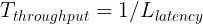
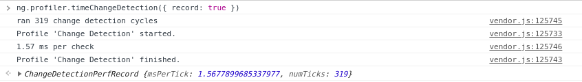

# Table of contents

...
...

## The problem behind the `performance` browser API

The `performance` (and especially `performance.measure`) API depends on computer speed and has a high variance (dispersion) factor. I noticed this several times that results were different depending on the load on my computer. We could still get the average value for some specific component, which is good 👌.

Such measurements are called _metastable_, in order to achieve a _stable_ measurement, a perfect balance of computer resources is needed.

## Small theory

Basically, the speed of systems can be characterized by such metrics as latency and throughput:

* _latency_ is the time it takes for **one** _global change detection_ to pass through the entire tree from the root component and until the very last
* _throughput_ is the number of _global change detections_ that can be run in fixed time

It's enough to understand that _throughput_ can be increased by decreasing _latency_. In order to reduce the _latency_, we need to reduce the number of _local change detections_ (since the _global change detection_ consists of many _local change detections_ for each component in the tree).

### Latency


In the above example the latency will equal to the sum of timings per each local change detection. There are 8 local change detections:


### Throughput

In a system where the code is executed in one thread, the throughput is calculated using the following formula:



## Angular built-in profiler

Angular already has a built-in change detection profiler which can be enabled in the development mode:

```ts
async function bootstrap() {
  await window.clickupCanBootstrapPromise;

  const { AppModule } = await import(
    /* webpackMode: 'eager' */ './app/app.module'
  );

  const { injector } = await platformBrowserDynamic().bootstrapModule(
    AppModule
  );

  if (isDevMode()) {
    const { enableDebugTools } = await import('@angular/platform-browser');
    const { components } = injector.get(ApplicationRef);
    enableDebugTools(components[0]);
  }
}

bootstrap();
```

> ⚠️ Such code can be shipped to the repository only with `if (ngDevMode)` condition. `isDevMode()` is a runtime function which will not be tree-shaken away by Terser, thus `enableDebugTools` and `AngularProfiler` will be bundled into the production bundle.

Therefore it will be accessible in the `window.ng` property. Let's open the DevTools and run it (note that I'm on the notifications page):

```js
ng.profiler.timeChangeDetection({ record: true })
```


> ⚠️ The profiler runs ticks during 500 ms.

> ⚠️ The profiler doesn't take into account that there can be `OnPush` components, even if the root component is marked as `OnPush` then the `ApplicationRef.tick()` will act as a noop.

Considering the above image we can calcuate the latency and throughput. Given the latency is 0.04 (ms per `tick()`), then the throughput will equal `1000 (ms in 1 second) / 0.04 = 25000` (change detections per second).

## Going deep

We can still use the same Angular's built-in profiler but we need to bypass `OnPush` checks.

### Bypassing `OnPush` checks in ViewEngine (for profiling purposes)

There is a function called `callViewAction` that does `OnPush` checks:

```js
function callViewAction(view, action) {
  switch (action) {
    case ViewAction.CheckAndUpdate:
      if ((viewState & 128 /* Destroyed */) === 0) {
        if ((viewState & 12 /* CatDetectChanges */) === 12 /* CatDetectChanges */) {
          checkAndUpdateView(view);
        } else if (viewState & 64 /* CheckProjectedViews */) {
          execProjectedViewsAction(view, ViewAction.CheckAndUpdateProjectedViews);
        }
      }
  }
}
```

`CatDetectChanges` equals `Attached | ChecksEnabled`, which is `8 (Attached) | 4 (ChecksEnabled) = 12`. Thus `(view.state & 12) === 12` will equal `true` when the view is attached to the change detection tree (it can be detached by calling `detach()` on the `ChangeDetectorRef`) and _checks are enabled_. When do checks become enabled? Angular calls `checkAndUpdateDirectiveInline` which is responsible for checking `@Input()` properties. If any binding has been changed then Angular calls `updateProp` which changes the view state:
```js
if (view.def.flags & 2 /* OnPush */) {
  view.state |= 8 /* ChecksEnabled */;
}
```

We can swap `if` conditions:

```js
function callViewAction(view, action) {
  switch (action) {
    case ViewAction.CheckAndUpdate:
      if ((viewState & 128 /* Destroyed */) === 0) {
        if (viewState & 64 /* CheckProjectedViews */) {
          execProjectedViewsAction(view, ViewAction.CheckAndUpdateProjectedViews);
        } else {
          checkAndUpdateView(view);
        }
      }
  }
}
```

### Bypassing `OnPush` checks in Ivy (for profiling purposes)

There is a function called `refreshComponents` that does `OnPush` checks:

```js
function refreshComponent(hostLView, componentHostIdx) {
  ...
  if (componentView[FLAGS] & (16 /* CheckAlways */ | 64 /* Dirty */)) {
    refreshView(tView, componentView, tView.template, componentView[CONTEXT]);
  } else if (componentView[TRANSPLANTED_VIEWS_TO_REFRESH] > 0) {
    refreshContainsDirtyView(componentView);
  }
}
```

We can swap `if` conditions:

```js
function refreshComponent(hostLView, componentHostIdx) {
  ...
  if (componentView[TRANSPLANTED_VIEWS_TO_REFRESH] > 0) {
    refreshContainsDirtyView(componentView);
  } else {
    refreshView(tView, componentView, tView.template, componentView[CONTEXT]);
  }
}
```

Let's run the profiler again:



Oh, we can see that the `msPerTick` now differs when `OnPush` cheks are bypassed therefore all components are checked. So now the throughput equals `1000 / 1.57 = 636` (change detections per second).