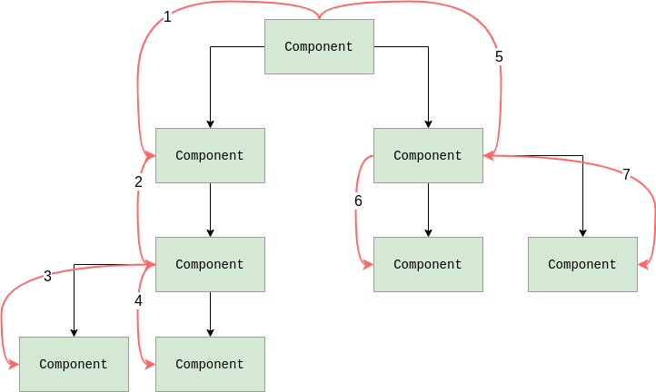
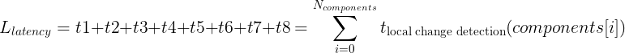
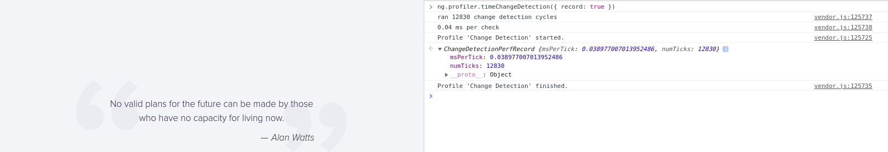

# Table of contents

...
...

## The problem behind the `performance` browser API

The `performance` (and especially `performance.measure`) API depends on computer speed and has a high variance (dispersion) factor. I noticed this several times that results were different depending on the load on my computer. We could still get the average value for some specific component, which is good 👌.

## Small theory

Basically, the speed of systems can be characterized by such metrics as latency and throughput:

* _latency_ is the time it takes for **one** _global change detection_ to pass through the entire tree from the root component and until the very last
* _throughput_ is the number of _global change detections_ that can be run in fixed time

It's enough to understand that _throughput_ can be increased by decreasing _latency_. In order to reduce the _latency_, we need to reduce the number of _local change detections_ (since the _global change detection_ consists of many _local change detections_ for each component in the tree).

### Latency



In the above example the latency will equal to the sum of timings per each local change detection. There are 8 local change detections:



## Angular built-in profiler

Angular already has a built-in change detection profiler which can be enabled in development mode:

```ts
async function bootstrap() {
  await window.clickupCanBootstrapPromise;

  const { AppModule } = await import(
    /* webpackMode: 'eager' */ './app/app.module'
  );

  const { injector } = await platformBrowserDynamic().bootstrapModule(
    AppModule
  );

  if (isDevMode()) {
    const { enableDebugTools } = await import('@angular/platform-browser');
    const { components } = injector.get(ApplicationRef);
    enableDebugTools(components[0]);
  }
}

bootstrap();
```

Therefore it will be accessible in the `window.ng` property. Let's open the DevTools and run it:

```js
ng.profiler.timeChangeDetection({ record: true })
```



This profiler doesn't take into account that there can be `OnPush` components, even if the root component is marked as `OnPush` then the `ApplicationRef.tick()` will act as a noop.
